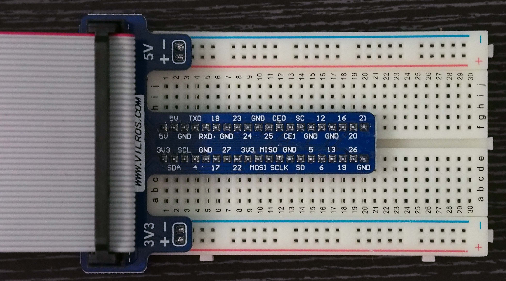
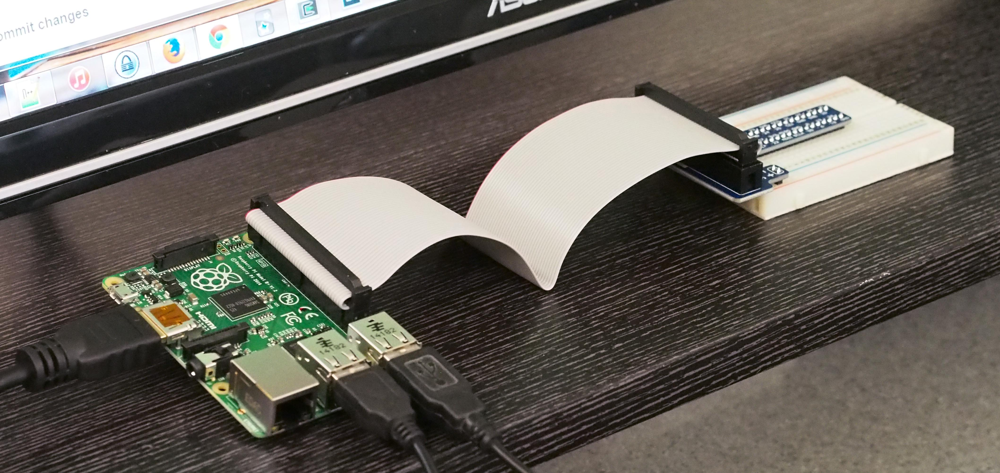
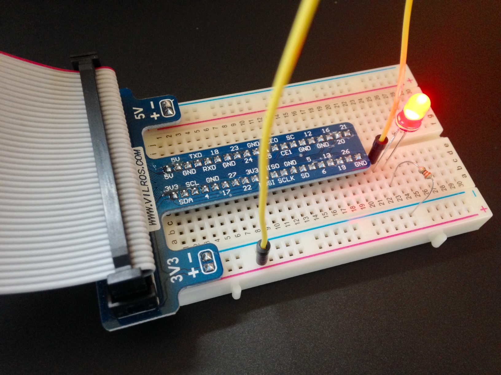
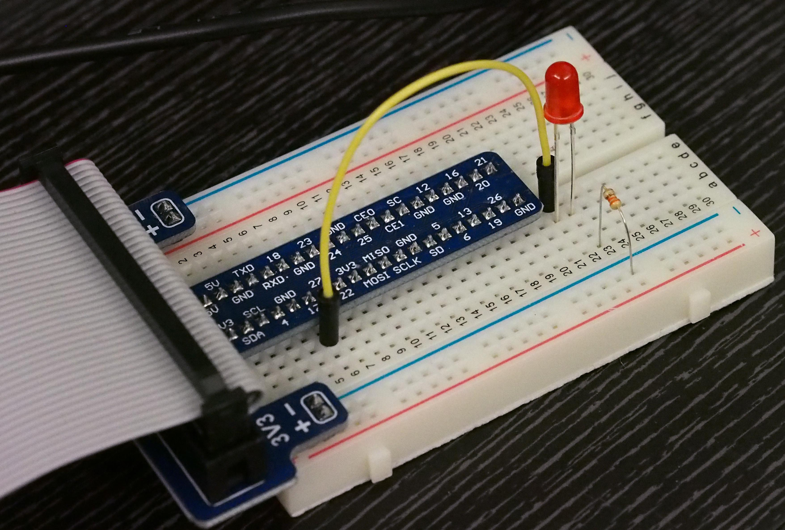
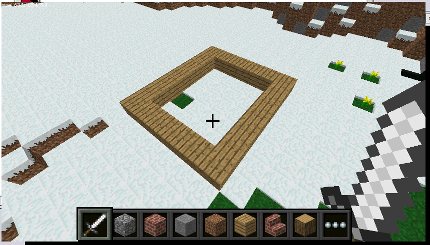
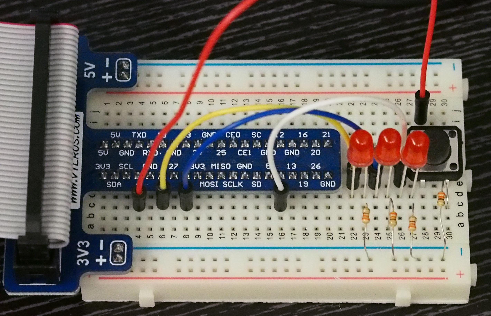
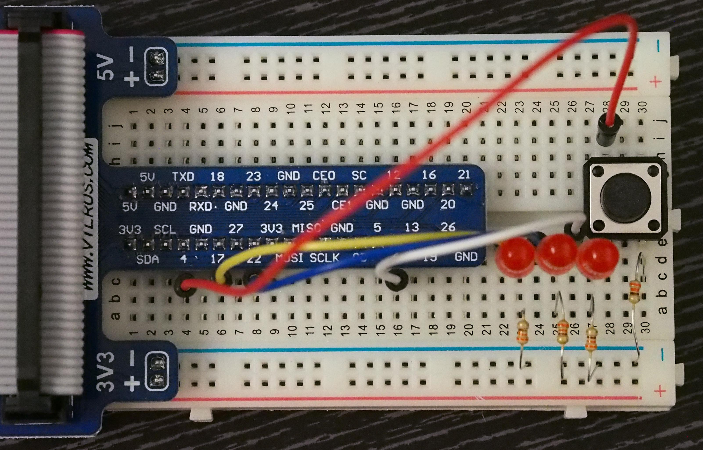

# Electronics / GPIO (General Purpose IO)

## Introduction

A **Breadboard** is a reusbale device with a number of holes into which you push wires or components to create circuits. Breadboards  allow you to create circuits without needing to solder all the components. The two rows of holes at the top and bottom are for power.

**Voltage** is the difference in electrical energy between two points in a circuit. This difference allows current to flow in a circuit, like water pressure in pipes. Voltage is measured in volts (V).

An **LED** (Light-Emitting Diode) ligts up when electricty passes through it. A diode only allows current to pass in one direction and will only light up if you pass your current in the correct direction. LEDs have one short leg (cathode or negative) and one long leg (anode or positive).

A **resistor** resists or limits current in a circuit. An LED can be damaged by too much current and adding a resistor of the correct value will limit the amount of current and the LED will be protected. Resistance is measured in Ohms and the value of a resistor is shown by coloured bands that are read from left to right. You can read more about color code on [wikipedia](https://en.wikipedia.org/wiki/Electronic_color_code). 

A **current** is the rate at which electrical energy flows through a circuit and is measured in amperes (A) or amps. Smaller currents are measured in milliApms (mA). You can read more about circuits [here](http://www.allaboutcircuits.com/textbook/direct-current/#chpt-1).

## Setup instructions
* The Raspberry PI should be up and running, no need to shut it down.
* Insert the breakout board into the breadboard, being careful to line up the pins like on the picture below.
* Connect the header cable between the Raspberry PI and the breakout board with the correct orientation (look at the red part of the cable ribbon).





Through the rest of the lesson, keep the breadboard oriented in a way that the 
lettering on the breakout board is visible to you (i.e. you should see SDA, GND, 
etc).

## A simple circuit

- Connect an LED, a 330 Ohm resistor and two short wires to the positive + (red line) and negative - (blue line) rows as shown.



## A programmable circuit

- Connect the positive + wire to GPIO pin 17.



- Run [led.py](scripts/intro.py)

```python
import RPi.GPIO as GPIO
import time

LED = 17
GPIO.setmode(GPIO.BCM)
GPIO.setup(LED, GPIO.OUT)  # setup for output

GPIO.output(LED, True)
time.sleep(1.0)

GPIO.cleanup()  # reset GPIO and disble circuitry
```

- Explain setup, output and cleanup.
- :bulb: Make your LED flash forever: [led_flash.py](scripts/led_flash.py)
- :bulb: Make your LED flash only 3 times: `for x in range(0,3)`
- :bulb: Modify your circuit and program to light 3 LEDS in a row, that is light up for countdown, and then flash all three together.

## The Intruder Alarm

Using the circuit you've created above, we will create an **Intruder Alarm**. It will tell us whether someone is inside our house, or our fence.

- Build a rectangular fence like on the screenshot below, or use a house that you've created previously.
- Previously, we're written some code to react based on your position compared to a wall. 
- The code will be similar, will need to figure out whether your current position is:
  - below the northern wall
  - above the southern wall
  - right of the leftmost wall
  - left of the rightmost wall
- Once the code is written, test it out by jumping in and out of your fence. The LED should light up when inside, and turn off when outside.



Solution: [fence_led.py](scripts/fence_led.py)

- :bulb: Make the LED flash when the intruder is getting **close** to the house, but not yet inside the house.
- :bulb: If you have three LEDs, successive LEDs light up as you get closer, and then all together when you enter the house.

## Programmable Button

- Add a button to the circuit: the button has four pins and fits nicely accross the midway point of the breadboard.
- Connect the button to GPIO pin 4 (positive +), and a 330 Ohm resistor to GND (negative -) as shown.
- You also need a resistor for the button to 'pull up' the button input to 3.3 volts, otherwise your button will generate spurious presses.
- :eyeglasses: When the button is not pressed (and no connection is made) the wire that connects the GPIO will be at 3.3 volts and the GPIO pin will interpret this as signal '1' or True (try printing the value of `GPIO.input(BUTTON)`). When you press the button, the circuit between the left and right hand pins will be completed abnd the GPIO wire is 'pulled down' to 0 volts. Now the GPIO pin will interpret the signal as '0' or False.
 





```python
import RPi.GPIO as GPIO
import mcpi.minecraft as minecraft
import time

mc = minecraft.Minecraft.create()

BUTTON = 4
GPIO.setmode(GPIO.BCM)
GPIO.setup(BUTTON, GPIO.IN, pull_up_down=GPIO.PUD_UP)   # setup for input

try:
    while GPIO.input(BUTTON):
        time.sleep(0.1)

    mc.postToChat('Button pressed!')
    
finally:
    GPIO.cleanup()  # reset GPIO and disable circuitry
```

## The Bulldozer Countdown

Using the circuit above, we will create a bulldozer countdown. After pressing the button, there will be a 3-second countdown using the 3 LEDs. Then the bulldozer code will be executed to clear space around you.

- Think about how to turn on all 3 LEDs together. You may call 3 separate **GPIO.output(LED, True)** instructions, but there may be a better way !


Solution: [led_countdown_bulldozer.py](scripts/led_countdown_bulldozer.py)

- :bulb: What if I want to dig a bigger hole by pressing the button repeatedly ?
- :bulb: Make the player jump up in the air when the bulldozer takes effect !
