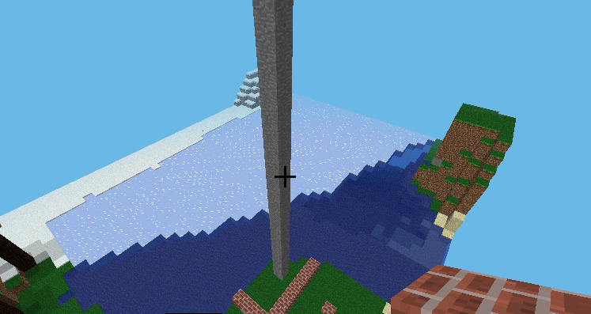
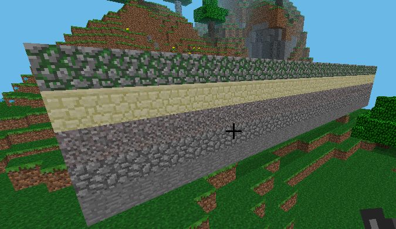

# Minecraft Programming using Python and Raspberry Pi

- Lesson plan is based on a 10am - 4pm day (including snack breaks!)
- Students will be a parent-child pair

### General Introductions (15 mins: 10am - 10:15am)

### Wooden Block Game (30 mins: 10:15 - 10:45am)

- Battle Ships!

- Building Instructions: 
  - B (Block) *x, y, z*
  - L (Loop) *start - end* 

- :trophy: Human Programmer Computer Challenges:
  - 4x3 wall
  - 3x3 cube
  - 8x pyramid
  - fort

### Setup Raspberry Pi (15 mins: 10:45am - 11am)
- Pi board
- SD Card (pre-setup)
- HDMI (display) cable
- Wifi
- Keyboard
- Mouse
- Power

### Introduction to Minecraft (20 mins: 11am - 11:20am)
  - What is Minecraft?
    - [What is Minecraft all about?](http://minemum.com/what-is-minecraft)
  - What is Minecraft Pi? (features and limitations)
    - [Pi Edition](http://minecraft.gamepedia.com/Pi_Edition)
  - Play the game!
    - Menu -> Minecraft
    - Start Game -> Create New (you can create new worlds till you get one you like)
  - Keys:
  
    Key | Action 
    --- | ------
    W	| Forward
    A	| Left 
    S	| Backward 
    D	|	Right
    Left-click | Hit
    Right-click | Place block
    Mouse-scroll | Hotbar select
    E	|	Inventory
    Space	|	Jump / Fly up
    Left Shift | Crouch / Fly down
    Double Space	|	Fly / Fall
    Esc	| Pause / Game menu
    Tab	| Release mouse cursor

- Minecraft coordinate system:
  - x-axis: East (positive), West (negative)
  - z-axis: South (positive), North (negative)
  - y-axis: High (positive), Low (negative)
  - Right-handed coordinates: thumb = x, index = y, middle = z
  

  - :trophy: Challenges for parents
    - Move to position 0,0,0
    - Learn to fly and swim
    - How big (x, z) is your world?
    - Can you find the South East corner of your world?
    - Build a house with stone walls, door, windows and wooden roof (bonus: fence around the house)
    - What are the dimensions (x, y, z) of your house?

### Introduction to Python (40 mins: 11:20am - noon)
- Why Python?
  - [A great first programming language](http://readwrite.com/2014/07/08/what-makes-python-easy-to-learn/)
  - [Python RefCard](https://dzone.com/refcardz/core-python)
- Getting started:
  - Menu -> Programming -> IDLE 2
  - Shell: run commands here for instruction and testing
  - File -> Open -> minecraft/scripts/[intro.py](scripts/intro.py) -> IDLE editor
  - Run: F5
  - Break: CTRL+C 
  - Case-sensitive
  - Indentation (for blocks)
- Learning Objectives:
  - Comments
  - Printing
  - Basic maths operators (add, subtract, multiply)
  - Basic variable types (strings, integers)
  - Concatenating strings
  - Casting an integer to a string
  - Booleans (True / False)
  - Inequalities (Greater Than / Less Than)
  - If/Else statements
  - For Loops
  - While Loops
  - Lists

  
### Minecraft Programming (60 - 70 mins: split accross lunch)
- [Instructions](MINECRAFT_PROGRAMMING.md)
- Tower
- Bulldozer
- Cube, Hollow Cube, House (+carpets?)
- Rent + Eject Timer ?
- Tunnel
- Treasure Hunt ?

### Lunch Break (30 mins)

### Minecraft Quiz (30 mins - TBD)
- Ideas:
  - (Bingo)[http://catchmyparty.com/blog/free-printable-minecraft-bingo-game]
  - Trivia Quiz (in teams)
- :gift: Prizes!

### Electronics (30 - 45 mins)
- [Instructions](MINECRAFT_ELECTRONICS.md)
- Light an LED
  - Non-programatically
  - Programatically and blink
  - Bulldozer: button
  - Rent: 3 LEDs (or 7 Segment display): eject countdown
- try : finally : cleanup

### Crafty Crossing
- TBD
